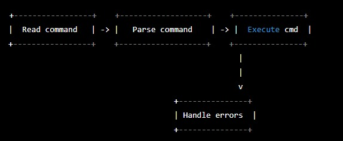

# Description
This is an ALX Project on Shell. We are tasked to come up with our own version of simple shell

The predominantly used calls are read, write, open, execve, exit, fflush, fork, free, malloc, getline, isatty, perror, strtok, wait, and waitpid.

**hsh** is a simple UNIX command language interpreter that reads commands from either a file or standard input and executes them.

How hsh Works
* Welcomes a shell user with his username!
* Prints a prompt and waits for a command from the user
* Creates a child process in which the command is checked
* Checks for built-ins, aliases in the PATH, and local executable programs
* The child process is replaced by the command, which accepts arguments
* When the command is done, the program returns to the parent process and prints the prompt
* The program is ready to receive a new command
* To exit: press Ctrl-D or enter "exit" (with or without a status)
* Works also in non interactive mode

## C language standard functions and system calls utilized ##
`access`, `chdir`, `close`, `closedir`, `execve`, `exit`, `fork`,
`free`, `fstat`, `getcwd`, `getline`, `kill`, `lstat`, `malloc`,
`open`, `opendir`, `perror`, `read`, `readdir`, `signal`, `stat`,
`strtok`, `wait`, `waitpid`, `wait3`, `wait4`, `write`, `_exit`

## Project Flowchat ##
These are the brief description about how the shll works
* The first step is to read the command from the user, this can be done using `read` function.
* The next step is to parse the command into separate tokens, this is achieved by using `strtok`.
* Then the parsed command is executed using the `execve` function.
* If there are any errors during the execution of the command, you handle them using `perror`.
* Finally, you handle any input/output redirection as needed.


## Project Requirements
* C language
* Shell
* Betty Linter

## General requirements for the Project
* All files will be compiled on Ubuntu 20.04 LTS using gcc, using the options -Wall -Werror -Wextra -pedantic -std=gnu89
* All files should end with a new line
* A README.md file, at the root of the folder of the project is mandatory
* Use the Betty style. It will be checked using betty-style.pl and betty-doc.pl
* Shell should not have any memory leaks
* No more than 5 functions per file
* All header files should be include guarded
* Write a README with the description of the project

## Compilation ##
Your shell will be compiled this way:

```
gcc -Wall -Werror -Wextra -pedantic -std=gnu89 *.c -o hsh
```

## Testing ##
Your shell should work like this in interactive mode:

~~~~
$ ./hsh
($) /bin/ls
hsh main.c shell.c
($)
($) exit
$
~~~~

But also in non-interactive mode:

~~~~
$ echo "/bin/ls" | ./hsh
hsh main.c shell.c test_ls_2
$
$ cat test_ls_2
/bin/ls
/bin/ls
$
$ cat test_ls_2 | ./hsh
hsh main.c shell.c test_ls_2
hsh main.c shell.c test_ls_2
$
~~~~

## Authors ##
* Oluwadamilola SONAIKE -  [github](https://github.com/damiso15) || [LinkedIn](https://www.linkedin.com/in/oluwadamilola-sonaike/)
* Michael NWOGHA - [github](https://github.com/MichaelDecent) || [LinkedIn](https://www.linkedin.com/in/michael-nwogha/)
